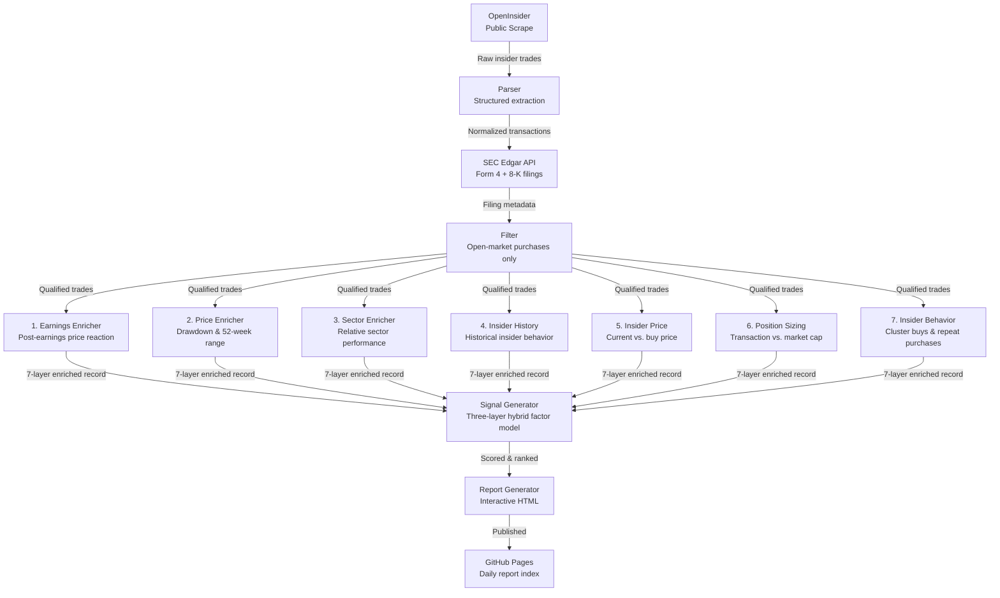

# InsiderSignal

<p align="left">
  
  
  
  
  
  
  
</p>

Automated pipeline that monitors SEC insider trading filings, enriches them with 7 layers of market context, and generates ranked buy signals — published daily to GitHub Pages.

---

## Problem Statement

Corporate insiders — executives, directors, and 10%+ shareholders — must disclose open-market purchases to the SEC via **Form 4** within 2 business days. Academic research consistently shows that **clustered, large-scale insider purchases** in open-market conditions are a statistically significant leading indicator of stock outperformance.

The challenge: raw Form 4 filings are noisy. Not all insider buys are equal. A CEO buying $50K of stock after a 60% drawdown near earnings is categorically different from a director exercising options at a pre-set price. Without enrichment and scoring, these signals are indistinguishable in raw data.

**InsiderSignal solves this** by:
- Filtering only genuine open-market purchases (no options, grants, or 10b5-1 auto-plans)
- Enriching each transaction with earnings context, price drawdown, sector performance, insider credibility, and cluster behavior
- Scoring and ranking signals using a three-layer factor aggregation model
- Delivering actionable, ranked output in an interactive HTML report — every day, automatically

---

## Architecture



---

## Pipeline Stages

| Stage | Module | Description |
|---|---|---|
| Fetch | `fetcher.py` | Scrapes OpenInsider for recent insider transactions |
| Parse | `parser.py` | Extracts structured fields from raw HTML |
| SEC Enrich | `sec_filing_fetcher.py` | Pulls Form 4 and 8-K data from SEC Edgar |
| Filter | `filter.py` | Retains only open-market purchase transactions |
| Enrich | `enrichments/` | Applies 7 independent enrichment modules |
| Signal | `signal_generator.py` | Scores each trade across conviction, credibility, timing, coordination, positioning |
| Report | `generate_html_report.py` | Renders interactive HTML with filter controls |
| Index | `generate_index.py` | Builds the master report index page |

---

## Signal Model

Signals are classified into four tiers using a **three-layer hybrid factor aggregation**:

| Signal | Criteria |
|---|---|
| **Strong Buy** | High conviction + credible insider + favorable timing |
| **Buy** | Moderate composite score across most factors |
| **Weak** | Low transaction size or mixed signals |
| **Noise** | Fails minimum threshold — filtered out |

**Factor dimensions scored:**
- Conviction — transaction size relative to insider's net worth proxy
- Credibility — insider role (CEO > CFO > Director > Officer)
- Timing — proximity to earnings, recent drawdown depth
- Coordination — cluster buying across multiple insiders
- Positioning — buy price vs. current price spread

---

## Enrichment Modules

```
enrichments/
├── 1_earnings_enricher.py       # Post-earnings price reaction context
├── 2_price_enricher.py          # Drawdown depth, 52-week range position
├── 3_sector_enricher.py         # Sector relative performance
├── 4_insider_history_enricher.py # Historical accuracy of this insider
├── 5_insider_price_enricher.py  # Current price vs. insider buy price
├── 6_position_sizing_enricher.py # Transaction size vs. market cap
└── 7_insider_behavior_enricher.py # Cluster buying, repeat purchase patterns
```

---

## Data Sources

All data is publicly available. No proprietary or paid APIs.

| Source | Data | Access |
|---|---|---|
| [OpenInsider](http://openinsider.com) | Insider transaction feed | Public web |
| [SEC Edgar](https://www.sec.gov/edgar) | Form 4, 8-K filings | Public REST API |
| [Yahoo Finance](https://finance.yahoo.com) | Stock prices, market cap | Public |

---

## Automation

Daily pipeline runs via GitHub Actions on a cron schedule:

- **Schedule**: 6:35 AM ET, every trading day
- **Jitter**: Random delay (anti-rate-limit)
- **Concurrency**: Single concurrent run enforced
- **Output**: Committed to repo + deployed to GitHub Pages

```
.github/workflows/daily-report.yml
```

---

## Getting Started

**Prerequisites:** Python 3.11+

```bash
git clone https://github.com/your-username/InsiderSignal.git
cd InsiderSignal
python -m venv venv
source venv/bin/activate       # Windows: venv\Scripts\activate
pip install -r requirements.txt
python main.py
```

**Output locations:**

| Path | Contents |
|---|---|
| `output/` | Enriched JSON trade records |
| `reports/` | Per-run HTML reports |
| `index.html` | Master report index |
| `logs/` | Execution logs |
| `cache/` | SQLite enrichment cache |

---

## Project Structure

```
InsiderSignal/
├── .github/workflows/          # GitHub Actions CI
├── enrichments/                # 7 enrichment modules
├── cache/                      # SQLite enrichment cache
├── logs/                       # Pipeline execution logs
├── output/                     # JSON trade records
├── reports/                    # Generated HTML reports
├── main.py                     # Entry point
├── pipeline.py                 # Pipeline orchestration
├── fetcher.py                  # OpenInsider scraper
├── parser.py                   # Data extraction
├── filter.py                   # Transaction filter
├── signal_generator.py         # Signal scoring model
├── generate_html_report.py     # HTML report renderer
├── generate_index.py           # Report index builder
├── sec_filing_fetcher.py       # SEC Edgar integration
├── CONSTANTS.py                # Configuration constants
└── requirements.txt            # Dependencies
```

---

## Disclaimer

This tool uses only publicly available data from SEC Edgar, OpenInsider, and Yahoo Finance. Output is for informational and research purposes only — not financial advice. No trading decisions should be made solely based on signals generated by this system.
